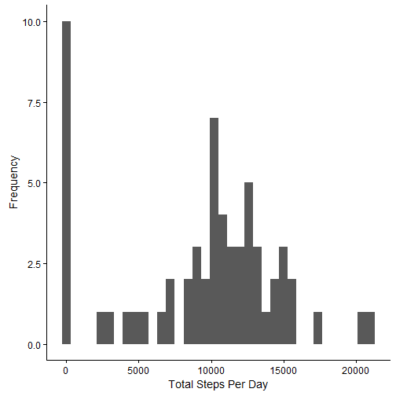
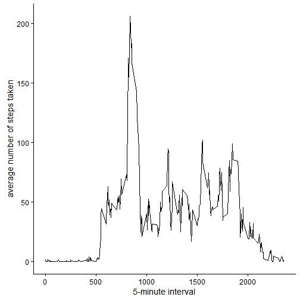
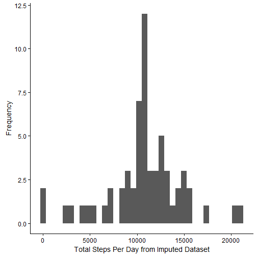
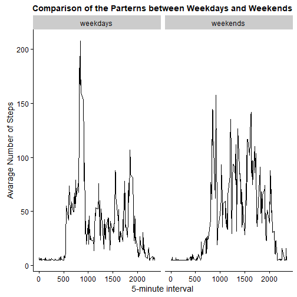

## Introduction

This is a single R markdown document that can be processed by knitr and be transformed into an HTML file in fulfiling the assignment in week 2. THe analysis steps were described in multiple parts. Answers to all the questions were detailed below.The related items were also commented inside the R code blocks. 


## A: Loading and preprocessing the data


```r
# Code for reading in the dataset and/or processing the data 
library("tidyverse")
library("lubridate")
activity <- read.csv("./activity/activity.csv")
activity2 <- mutate(activity, ymd(date))
names(activity2)[4] <- "date2" 
```

## B: What is mean total number of steps taken per day?


```r
TotalStepsPerDay <- tapply(activity$steps, activity$date, sum, na.rm=TRUE)
# report the total steps per day
TotalStepsPerDay
```

```
## 2012-10-01 2012-10-02 2012-10-03 2012-10-04 2012-10-05 2012-10-06 
##          0        126      11352      12116      13294      15420 
## 2012-10-07 2012-10-08 2012-10-09 2012-10-10 2012-10-11 2012-10-12 
##      11015          0      12811       9900      10304      17382 
## 2012-10-13 2012-10-14 2012-10-15 2012-10-16 2012-10-17 2012-10-18 
##      12426      15098      10139      15084      13452      10056 
## 2012-10-19 2012-10-20 2012-10-21 2012-10-22 2012-10-23 2012-10-24 
##      11829      10395       8821      13460       8918       8355 
## 2012-10-25 2012-10-26 2012-10-27 2012-10-28 2012-10-29 2012-10-30 
##       2492       6778      10119      11458       5018       9819 
## 2012-10-31 2012-11-01 2012-11-02 2012-11-03 2012-11-04 2012-11-05 
##      15414          0      10600      10571          0      10439 
## 2012-11-06 2012-11-07 2012-11-08 2012-11-09 2012-11-10 2012-11-11 
##       8334      12883       3219          0          0      12608 
## 2012-11-12 2012-11-13 2012-11-14 2012-11-15 2012-11-16 2012-11-17 
##      10765       7336          0         41       5441      14339 
## 2012-11-18 2012-11-19 2012-11-20 2012-11-21 2012-11-22 2012-11-23 
##      15110       8841       4472      12787      20427      21194 
## 2012-11-24 2012-11-25 2012-11-26 2012-11-27 2012-11-28 2012-11-29 
##      14478      11834      11162      13646      10183       7047 
## 2012-11-30 
##          0
```


Make a histogram of the total number of steps taken each day


```r
# Histogram of the total number of steps taken each day
qplot(TotalStepsPerDay, xlab='Total Steps Per Day', ylab='Frequency', binwidth=600)
```




## C: What is the average daily activity pattern?


```r
# Mean and median number of steps taken each day
# Mean
stepsByDayMean <- mean(TotalStepsPerDay)
stepsByDayMean
```

```
## [1] 9354.23
```

```r
# Median
stepsByDayMedian <- median(TotalStepsPerDay)
stepsByDayMedian
```

```
## [1] 10395
```


Make a time series plot of the 5-minute interval (x-axis) and the average number of steps taken, averaged across all days (y-axis). 


```r
#making a time series plot
averageStepsPerTimeBlock <- aggregate(x=list(meanSteps=activity$steps), by=list(interval=activity$interval), FUN=mean, na.rm=TRUE)
library(ggplot2)
ggplot(data=averageStepsPerTimeBlock, aes(x=interval, y=meanSteps)) +
    geom_line() +
    xlab("5-minute interval") +
    ylab("average number of steps taken") 
```




Which 5-minute interval, on average across all the days in the dataset, contains the maximum number of steps?


```r
mostSteps <- which.max(averageStepsPerTimeBlock$meanSteps)
timeMostSteps <-  gsub("([0-9]{1,2})([0-9]{2})", "\\1\\2", averageStepsPerTimeBlock[mostSteps,'interval'])
# So maximum number of steps is
timeMostSteps
```

```
## [1] "835"
```

## D: Imputing missing values

Note that there are a number of days/intervals where there are missing values (coded as 𝙽𝙰). The presence of missing days may introduce bias into some calculations or summaries of the data. Calculate and report the total number of missing values in the dataset (i.e. the total number of rows with 𝙽𝙰s)
I used the impute and mean functions to create a new dataset that is equal to the original dataset but with the missing data filled in.


```r
#Calulate and report the total number of missing values in the dataset
missing <- is.na(activity$steps)
#total number of missing values
table(missing)
```

```
## missing
## FALSE  TRUE 
## 15264  2304
```

```r
# Create a new dataset that is equal to the original dataset but with the missing data filled in.
library(scales)
library(Hmisc)
activityImputed <- activity
activityImputed$steps <- impute(activity$steps, fun=mean) # computing the (single) imputed value from the non-NAs
```


```r
# Get answers from the mutated dataset
stepsByDayImputed <- tapply(activityImputed$steps, activityImputed$date, sum)
qplot(stepsByDayImputed, xlab='Total Steps Per Day from Imputed Dataset', ylab='Frequency', binwidth=600)
```



```r
# Calculate and report the mean and median total number of steps taken per day.
#Mean
(stepsByDayMeanImputed <- mean(stepsByDayImputed))
```

```
## [1] 10766.19
```

```r
#Median
(stepsByDayMedianImputed <- median(stepsByDayImputed))
```

```
## [1] 10766.19
```
Results from the imputed data are different from the first part of this assignment. Imputing missing data made the mean and median the same. 


## E: Are there differences in activity patterns between weekdays and weekends?


```r
# Create a new factor variable in the dataset with two levels – “weekdays” and “weekends” 
activityImputed$Type <-  ifelse(as.POSIXlt(activityImputed$date)$wday %in% c(0,6), 'weekends', 'weekdays')
# Make a panel plot containing a time series plot
averagedActivityImputed <- aggregate(steps ~ interval + Type, data=activityImputed, mean)
ggplot(averagedActivityImputed, aes(interval, steps)) + 
    geom_line() + 
    facet_grid(. ~ Type) +
    xlab("5-minute interval") + 
    ylab("avarage number of steps") +
    theme(plot.title = element_text(hjust = 0.5)) +
    labs(title = "Comparison of the parterns between weekdays and weekends")
```




